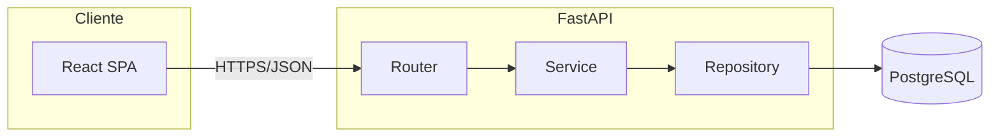
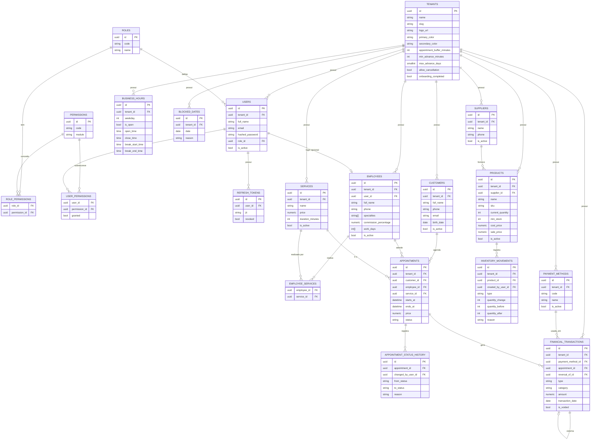
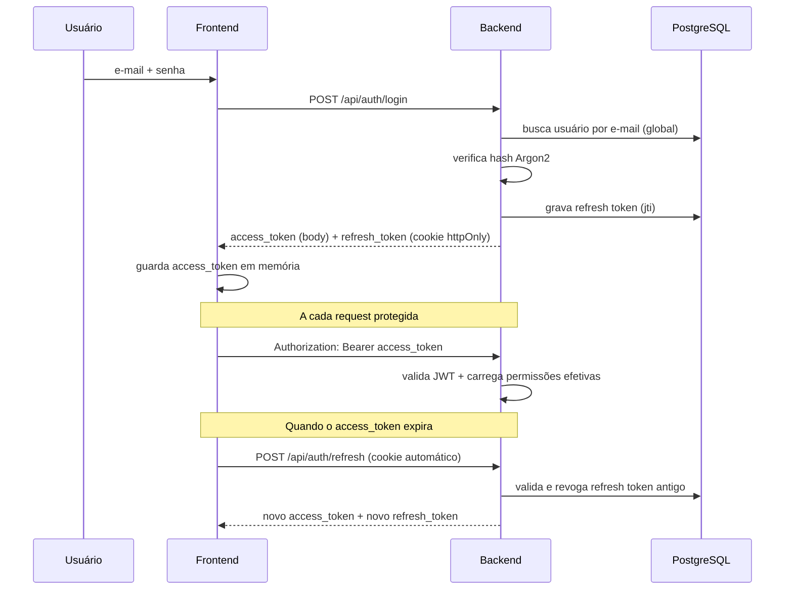

# BarberFlow

Sistema web SaaS multi-tenant para gestão de barbearias — clientes, profissionais, serviços, agenda, estoque e financeiro, com isolamento total de dados entre barbearias.

Projeto desenvolvido como portfólio de Análise e Desenvolvimento de Sistemas, priorizando arquitetura profissional, regras de negócio reais e segurança — não um CRUD genérico.

> **Status atual: Fase 8 — Personalização concluída.** Fundação, Clientes, Serviços, Profissionais, Agenda, Estoque, Financeiro, Dashboard e Personalização estão implementados e testados. As demais fases (integrações, qualidade, deploy) estão no [roadmap](#roadmap) e serão implementadas incrementalmente.

## O problema

Barbearias pequenas e médias costumam gerenciar agenda, clientes, estoque e financeiro em ferramentas soltas (papel, WhatsApp, planilhas), o que gera conflitos de horário, falta de controle de estoque e nenhuma visibilidade financeira consolidada.

## A solução

Uma plataforma única por barbearia (tenant), com controle de acesso granular por cargo e permissão, onde o proprietário administra toda a operação: agenda com regras de conflito, estoque com movimentações auditadas, financeiro com histórico imutável, e relatórios gerenciais.

## Funcionalidades

### Implementado (Fase 1 — Fundação)

- Cadastro inicial de barbearia (signup) com criação automática do usuário OWNER
- Login / logout / refresh de sessão (JWT de acesso curto + refresh token rotativo em cookie httpOnly)
- Isolamento multi-tenant garantido no backend (nunca no frontend) — testado automaticamente
- RBAC com 4 papéis padrão (OWNER, MANAGER, BARBER, RECEPTIONIST) e permissões granulares customizáveis por usuário
- Gestão de funcionários (criar, editar, ativar/desativar, atribuir cargo, override de permissões)
- Tratamento de erros seguro (mensagens amigáveis ao usuário, detalhes técnicos apenas em log)

### Implementado (Fase 2 — Clientes)

- Cadastro de clientes com validação de telefone (BR) e e-mail
- Edição, desativação/reativação (soft delete — histórico nunca é perdido)
- Busca por nome/telefone/e-mail, filtro por status e paginação
- Perfil do cliente (dados pessoais; histórico de atendimentos chegará nas Fases 4/6)
- Layout com navegação lateral (sidebar) compartilhado entre as páginas autenticadas

### Implementado (Fase 3 — Serviços e Profissionais)

- Catálogo de serviços (nome, preço, duração, categoria), com desativação preservando histórico
- Cadastro de profissionais (barbeiros): telefone, especialidades, comissão, horário e dias de trabalho
- Vínculo opcional entre profissional e conta de login (`User`), e vínculo N:N entre profissional e os serviços que realiza
- Entidade `Employee` (profissional) mantida separada de `User` (conta de login) — ver [decisões técnicas](#decisões-técnicas-relevantes)

### Implementado (Fase 4 — Agenda)

- Agendamentos com cliente, profissional, serviço, horário, valor, forma de pagamento e observações
- Visualizações dia, semana e mês
- Máquina de estados completa: PENDING → CONFIRMED → IN_PROGRESS → COMPLETED, com CANCELLED e NO_SHOW como saídas, e trilha de auditoria de cada mudança (`appointment_status_history`)
- Regras de conflito aplicadas a todos os papéis, inclusive OWNER: sem sobreposição de horário para o mesmo profissional, respeitando o horário de funcionamento da barbearia, os dias/horários de trabalho do profissional, datas bloqueadas e os serviços que ele realmente realiza
- Horário de funcionamento (`business_hours`) semeado automaticamente no cadastro da barbearia (seg-sáb 09h-19h, domingo fechado) e datas bloqueadas (`blocked_dates`) configuráveis via API — tela de configuração completa fica para a Fase 8
- Cancelamento exige motivo, registrado no histórico

### Implementado (Fase 5 — Estoque)

- Produtos com SKU (único por tenant), categoria, preço de custo/venda, estoque mínimo e fornecedor
- Toda alteração de estoque gera uma movimentação auditável (`inventory_movements`) — nunca é possível alterar a quantidade diretamente, mesmo pelo OWNER
- Seis tipos de movimentação: entrada, saída, ajuste, perda, venda e devolução
- Estoque nunca fica negativo: saídas que excedem o saldo são bloqueadas
- Ajuste de estoque (contagem física) é uma permissão distinta (`inventory.adjust`) e sempre exige motivo
- Alerta visual de estoque baixo (quantidade ≤ mínimo) na listagem e no detalhe do produto — o mesmo indicador que o dashboard (Fase 7) reaproveitará
- Cadastro de fornecedores com CRUD próprio

### Implementado (Fase 6 — Financeiro)

- Lançamentos de entrada/saída com categoria, forma de pagamento e usuário responsável
- **Fechamento de atendimento integrado** (seção 20): finalizar um agendamento na Agenda gera automaticamente a entrada financeira do serviço e, se produtos foram vendidos durante o atendimento, dá baixa no estoque e registra a venda — tudo numa única transação de banco
- Livro-razão imutável: nenhuma transação é editável ou apagável — correções são sempre um **estorno** (nova transação de sinal oposto, vinculada à original)
- Formas de pagamento configuráveis (dinheiro, PIX, débito, crédito, outros), ativáveis/desativáveis pelo dono
- Resumo financeiro por período (entradas, saídas, saldo)

### Implementado (Fase 7 — Dashboard)

- Indicadores (faturamento do dia/mês, despesas do mês, agendamentos hoje, ticket médio, clientes cadastrados) e alertas (estoque baixo, agendamentos pendentes, horários próximos, serviços desativados)
- Próximos agendamentos e 6 gráficos: faturamento por dia/mês, serviços mais realizados, profissionais com mais atendimentos, formas de pagamento e evolução de clientes
- Dashboard completo restrito a quem tem `reports.view` (OWNER/MANAGER); BARBER e RECEPTIONIST veem uma versão simplificada com os próprios atendimentos do dia
- Modo escuro corrigido para o app inteiro (ver [decisões técnicas](#decisões-técnicas-relevantes))

### Implementado (Fase 8 — Personalização)

- Tela de Configurações com cinco seções: Informações (dados da barbearia), Funcionamento (horário por dia da semana, com intervalo de almoço opcional), Agendamento (antecedência mínima/máxima, intervalo entre atendimentos, permitir cancelamento), Aparência (cores primária/secundária, logo) e Datas bloqueadas
- Tema dinâmico por tenant: cor primária/secundária definidas em Aparência são aplicadas em tempo real (antes mesmo de salvar) em toda a interface via custom properties CSS, e persistem entre sessões
- Logo do tenant substitui o nome "BarberFlow" no menu lateral quando configurado
- Regras de agenda configuráveis pelo próprio dono: antecedência mínima/máxima para agendar, intervalo de almoço bloqueando a agenda, e permissão de cancelamento — todas aplicadas em `appointment_service`, os mesmos pontos de validação usados desde a Fase 4
- Alteração de configurações restrita a `settings.edit` (apenas OWNER, por padrão — seção 3 da especificação); demais papéis não visualizam nem alteram a tela

### Planejado (ver [roadmap](#roadmap))

Notificações, integração com Discord, auditoria, relatórios detalhados com filtro de período.

## Stack tecnológica

**Frontend:** React + TypeScript + Vite + Tailwind CSS + React Router + TanStack Query + React Hook Form + Zod + Zustand + Recharts

**Backend:** Python + FastAPI + Pydantic + SQLAlchemy 2.0 + Alembic + JWT (PyJWT) + Argon2 (passlib)

**Banco de dados:** PostgreSQL 17

**Infra:** Docker + Docker Compose

**Testes:** Pytest (backend) + Vitest/React Testing Library (frontend)

**Qualidade:** Ruff, ESLint, Prettier

## Arquitetura

Backend em camadas, com regras de negócio isoladas na camada de serviço:



Todo repositório de dados de tenant (`TenantScopedRepository`) exige `tenant_id` no construtor e filtra automaticamente por ele em toda query — estruturalmente impossível esquecer o isolamento multi-tenant. O `tenant_id` vem sempre do JWT validado no backend, nunca de parâmetros da requisição.

## Modelo de dados (Fases 1–8)



## Fluxo de autenticação



## Como executar

### Com Docker Compose (recomendado)

```bash
cp .env.example .env
# edite .env e defina POSTGRES_PASSWORD e JWT_SECRET_KEY

docker compose up --build
```

- Backend: http://localhost:8000 (docs em `/docs`)
- Frontend: http://localhost:5173
- Após subir, rode o seed dentro do container do backend:

```bash
docker compose exec backend python -m app.seed
```

### Manualmente (desenvolvimento)

**Backend:**

```bash
cd backend
python -m venv .venv
.venv\Scripts\activate        # Windows
# source .venv/bin/activate   # Linux/Mac
pip install -r requirements-dev.txt
cp .env.example .env          # ajuste DATABASE_URL para seu Postgres local

alembic upgrade head
python -m app.seed
uvicorn app.main:app --reload
```

**Frontend:**

```bash
cd frontend
npm install
npm run dev
```

## Variáveis de ambiente

| Variável | Descrição | Onde |
|---|---|---|
| `DATABASE_URL` | String de conexão PostgreSQL (driver `psycopg`) | backend |
| `JWT_SECRET_KEY` | Segredo para assinatura dos tokens JWT | backend |
| `ACCESS_TOKEN_EXPIRE_MINUTES` | Duração do access token | backend |
| `REFRESH_TOKEN_EXPIRE_DAYS` | Duração do refresh token | backend |
| `CORS_ORIGINS` | Origens permitidas (JSON array) | backend |
| `POSTGRES_USER` / `POSTGRES_PASSWORD` / `POSTGRES_DB` | Credenciais do banco (docker-compose) | infra |

Nunca commitar `.env`. Use sempre `.env.example` como referência.

## Testes

**Backend** (requer um PostgreSQL acessível — ajuste a URL em `tests/conftest.py` ou via variável de ambiente):

```bash
cd backend
pytest -v
```

Inclui testes obrigatórios de isolamento multi-tenant (`tests/test_multitenancy.py`): garantem que um usuário de um tenant nunca acessa ou altera dados de outro tenant, mesmo manipulando IDs manualmente na requisição.

**Frontend:**

```bash
cd frontend
npm run test
```

## Demonstração / Seed

O comando `python -m app.seed` popula:

- Todas as roles e permissões do sistema
- Uma barbearia de demonstração: **Elite Barber**
- Três usuários de demonstração (senha: `Demo@1234`, **apenas para ambiente de desenvolvimento**):
  - `admin@elitebarber.com` — OWNER
  - `barbeiro@elitebarber.com` — BARBER
  - `recepcao@elitebarber.com` — RECEPTIONIST

## Decisões técnicas relevantes

- **E-mail globalmente único** (não por tenant): simplifica o login (não exige identificar a barbearia antes de autenticar) sem enfraquecer o isolamento multi-tenant, que é garantido na camada de dados/autorização, não no login.
- **Refresh token em cookie httpOnly + access token em memória no frontend**: reduz superfície de ataque XSS (token de acesso nunca toca `localStorage`).
- **Permissões efetivas = permissões padrão do role + overrides individuais**: permite ao OWNER customizar o acesso de um funcionário específico sem duplicar todo o conjunto de permissões do sistema.
- **`psycopg` (v3) em vez de `psycopg2`**: driver PostgreSQL mais moderno, com melhor suporte a versões recentes do Python.
- **Conflito de horário na agenda é regra de integridade, não de permissão**: nem o OWNER pode sobrepor dois agendamentos para o mesmo profissional — validado em `appointment_service._validate_schedule`, chamado tanto na criação quanto no reagendamento.
- **`Employee` (profissional) é uma entidade separada de `User` (conta de login)**: nem todo profissional precisa de acesso ao sistema, e nem todo usuário logado é um profissional que atende clientes (ex.: um gerente administrativo). `Employee.user_id` é uma FK opcional que vincula os dois quando aplicável. Essa separação segue o modelo de dados original da especificação (tabelas `users` e `employees` distintas) e evita forçar todo profissional a ter e-mail/senha.
- **`business_hours`/`blocked_dates` semeados com padrão sensato no cadastro da barbearia**: a Agenda (Fase 4) depende desses dados para validar horários, mas a tela de configuração completa (seção 22 da especificação) só chega na Fase 8. Em vez de bloquear a Fase 4 esperando a Fase 8, o sistema já nasce com segunda-sábado 09h-19h e domingo fechado, ajustável via API desde já e com UI dedicada depois.
- **`duration_minutes` e `price` são copiados para o agendamento no momento da criação**: alterações futuras no catálogo de serviços (preço, duração) não alteram retroativamente agendamentos já criados — preserva o histórico (seção 49 da especificação).
- **Reagendamento não é modelado como um status novo**: `remarcar` altera `starts_at`/`employee_id` e gera uma entrada no histórico com o status inalterado e a mudança descrita no campo `reason`, evitando confundir "estado do atendimento" com "houve uma alteração de horário".
- **`Product.current_quantity` é um cache, nunca a fonte de verdade**: todo endpoint que altera estoque (entrada/saída/perda/venda/devolução/ajuste) passa por `inventory_service._apply_movement`, que atualiza o saldo e grava a `InventoryMovement` na mesma transação — não existe endpoint genérico de "editar quantidade". Isso torna estruturalmente impossível alterar estoque sem deixar rastro (seção 16 da especificação).
- **Ajuste de estoque tem permissão própria (`inventory.adjust`)**: distinta de `inventory.create`/`inventory.edit`, porque corrigir uma contagem física é uma ação sensível e deliberadamente mais restrita — o catálogo de permissões já previa essa separação desde a Fase 1.
- **Transação financeira é imutável; correção é sempre um estorno**: não existe `PATCH`/`DELETE` para `financial_transactions` (seção 50 da especificação). `void_transaction` cria uma nova transação de sinal oposto vinculada à original (`reversal_of_id`) e marca a original como `is_voided`. O resumo financeiro soma **todas** as transações do período, voided ou não — a original (ex.: -1500) e o estorno (+1500) se anulam naturalmente na soma; excluir a original do somatório inflaria o saldo pelo valor do estorno (bug encontrado e corrigido durante a validação visual desta fase).
- **Fechamento de atendimento é atômico entre três módulos**: finalizar um agendamento (Agenda) valida a forma de pagamento, registra a entrada financeira do serviço (Financeiro) e, se houver produtos vendidos, dá baixa no estoque e registra a venda (Estoque) — tudo dentro de uma única transação de banco (`complete_appointment`), usando um parâmetro interno `commit=False` nos serviços de estoque/financeiro para adiar o commit até o fim.
- **Dashboard completo é restrito a `reports.view`, mas a rota `/dashboard` não é**: todo usuário autenticado precisa de uma página inicial. Em vez de um erro 403 para BARBER/RECEPTIONIST (que não têm `reports.view` por padrão), o frontend decide no cliente qual view pedir — quem tem a permissão carrega `GET /api/dashboard` (métricas completas); quem não tem never chama esse endpoint e vê só os próprios atendimentos do dia, reaproveitando `GET /api/appointments` (que eles já podem acessar).
- **Gráficos por dia/mês constroem os buckets vazios no backend**: se não houve faturamento em um dos 14 dias ou 6 meses da janela, o ponto ainda aparece no gráfico com valor zero — sem isso, o eixo do tempo ficaria com buracos e a linha/barra enganaria sobre quando o negócio esteve parado.
- **Modo escuro dependia de uma classe `.dark` que nada aplicava**: o Tailwind estava configurado com `darkMode: "class"` desde a Fase 1, e todo componente já usava classes `dark:`, mas nenhum código adicionava essa classe — o app estava, na prática, sempre em modo claro. Corrigido com `initTheme()` (`src/lib/theme.ts`), que sincroniza `.dark` com `prefers-color-scheme` do sistema operacional.
- **Tema por tenant é implementado com custom properties CSS, não recompilando o Tailwind**: `--color-brand`/`--color-brand-secondary` já existiam desde a Fase 1 como valores fixos em `index.css`; a Fase 8 apenas passou a sobrescrevê-los em runtime (`applyBrandColors`, `src/lib/theme.ts`) com a cor do tenant carregado. Isso permite pré-visualizar a cor escolhida em Configurações → Aparência instantaneamente, antes mesmo de salvar, sem precisar de um build por tenant.
- **`business_hours.break_start_time`/`break_end_time` eram aceitos pelo schema mas nunca persistidos**: `scheduling_settings_service.update_business_hours` atualizava `is_open`/`open_time`/`close_time` mas esquecia os dois campos de intervalo — o endpoint retornava 200 e o valor enviado simplesmente desaparecia. Só foi percebido porque o teste `test_business_hours_break_blocks_appointment` validou o comportamento fim-a-fim (salvar o intervalo e depois tentar agendar dentro dele), não apenas o formato da resposta do PATCH. Corrigido preenchendo os dois campos que faltavam.
- **Antecedência mínima/máxima e intervalo de almoço são validados no mesmo lugar que os demais conflitos de agenda**: `appointment_service._validate_schedule` já centralizava as checagens de horário de funcionamento, profissional e serviço desde a Fase 4; a Fase 8 apenas adicionou as novas condições ali, em vez de criar uma camada de validação paralela.
- **Configurações são restritas a `settings.edit`/`settings.view`, e nenhum papel além de OWNER os possui por padrão**: ao contrário de outros módulos (onde MANAGER normalmente tem `view`+`edit` e BARBER/RECEPTIONIST têm no máximo `view`), a especificação (seção 3) é explícita que configurações críticas são exclusivas do proprietário — por isso MANAGER recebe 403 tanto para ler quanto para alterar `/api/settings/*`, não apenas para alterar.

## Roadmap

- [x] **Fase 1** — Fundação: estrutura, Docker, banco, autenticação, multi-tenancy, usuários, permissões
- [x] **Fase 2** — Clientes: CRUD, busca/filtro, paginação (histórico completo depende das Fases 4/6)
- [x] **Fase 3** — Serviços (catálogo) e Profissionais (especialidades, comissão, horário, serviços realizados)
- [x] **Fase 4** — Agenda: visualizações dia/semana/mês, máquina de estados, regras de conflito de horário
- [x] **Fase 5** — Estoque: produtos, movimentações auditadas, alertas de estoque baixo, fornecedores
- [x] **Fase 6** — Financeiro: entradas/saídas, estorno, formas de pagamento, fechamento de atendimento integrado
- [x] **Fase 7** — Dashboard: indicadores, alertas, próximos agendamentos e 6 gráficos (Recharts)
- [x] **Fase 8** — Personalização: logo, cores, configurações de agenda e funcionamento, tema dinâmico por tenant
- [ ] **Fase 9** — Integrações: Discord, notificações
- [ ] **Fase 10** — Qualidade: testes ampliados, segurança, documentação, CI/CD
- [ ] **Fase 11** — Deploy: produção, domínio, monitoramento

## Estrutura do projeto

```
/barberflow
  /frontend         React + TypeScript + Vite
  /backend
    /app
      /auth
      /core          config, security, deps, exceptions, permissions
      /db            base, session
      /models        SQLAlchemy
      /schemas       Pydantic
      /repositories  acesso a dados (tenant-scoped)
      /services      regras de negócio
      /routers       endpoints FastAPI
      /tests
    /alembic         migrations
  /infra
    /docker
  /docs
  docker-compose.yml
  .env.example
```

## Licença

MIT — veja [LICENSE](LICENSE).
